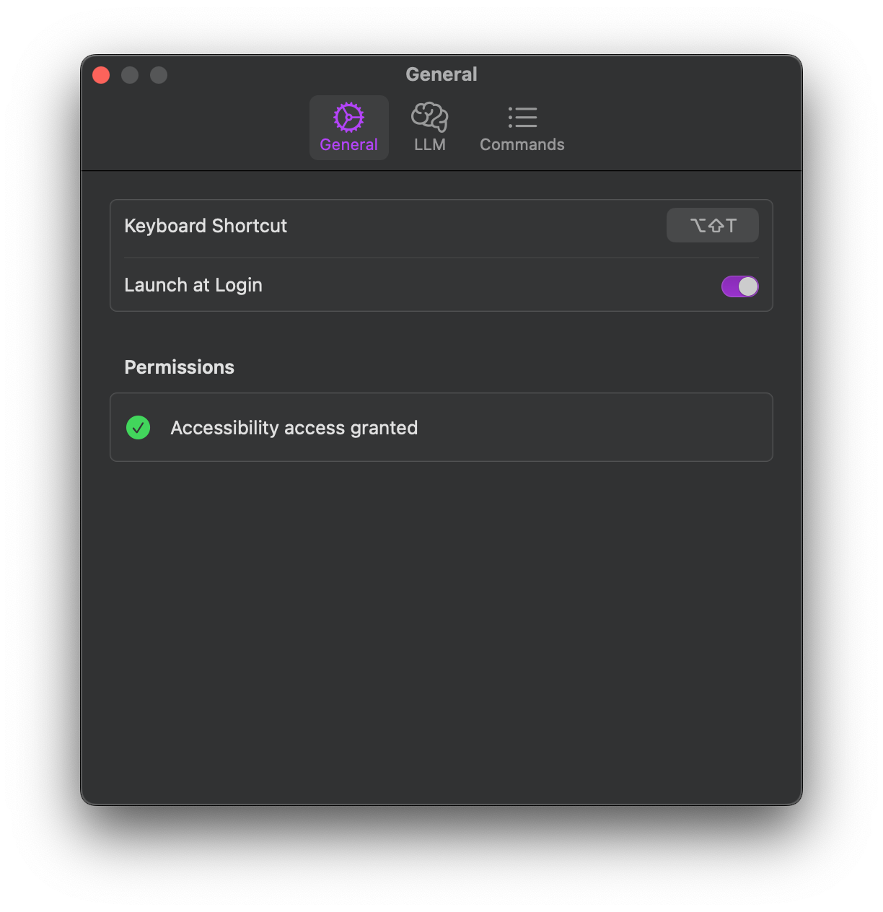
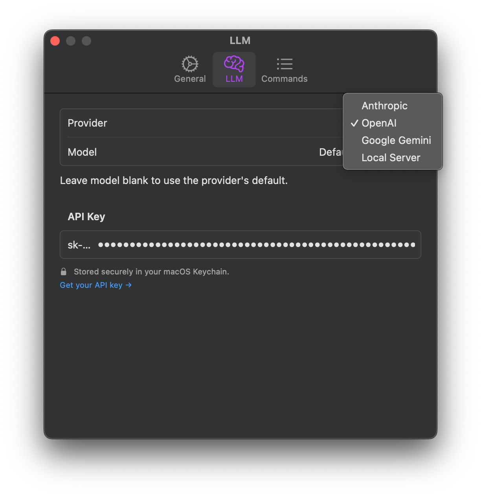
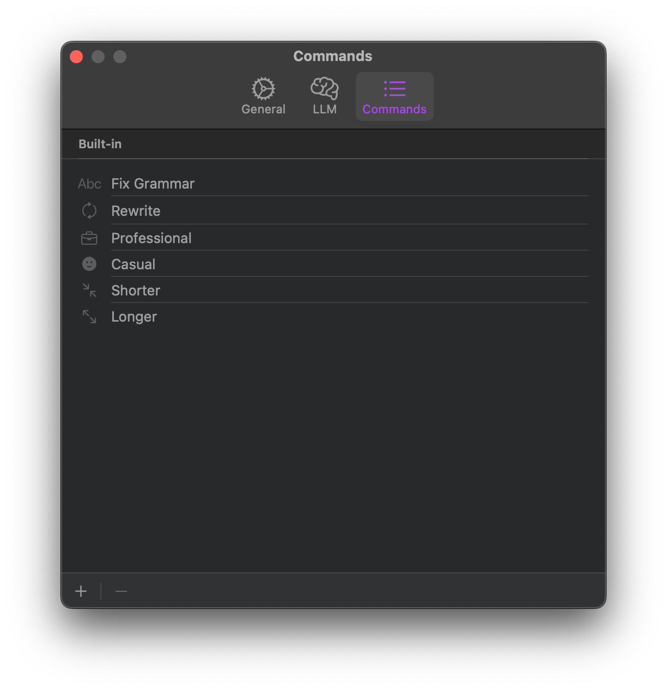
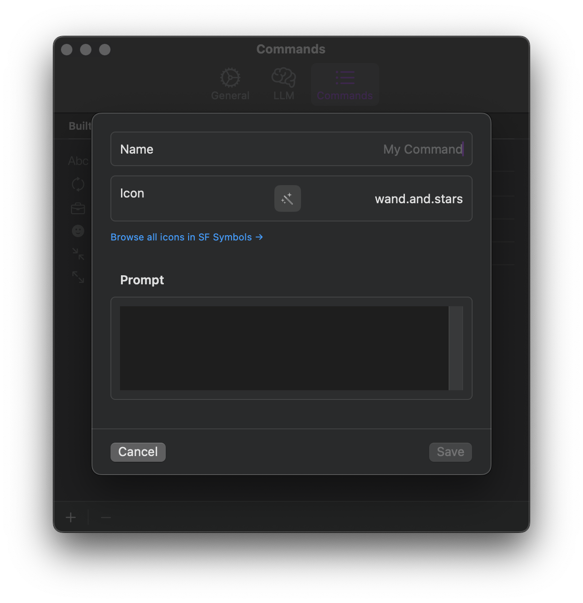
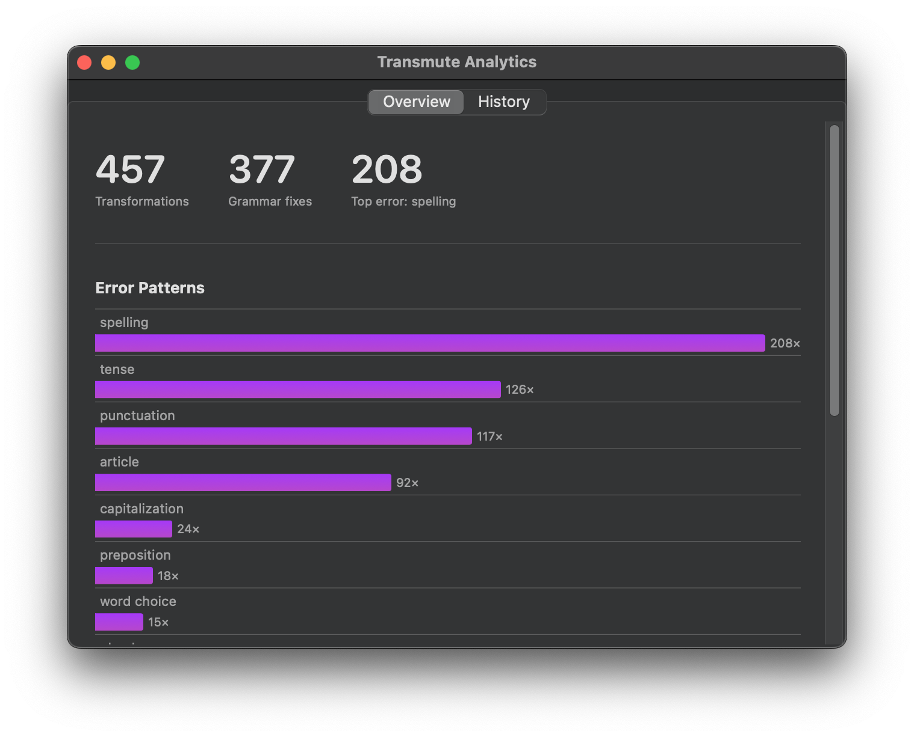
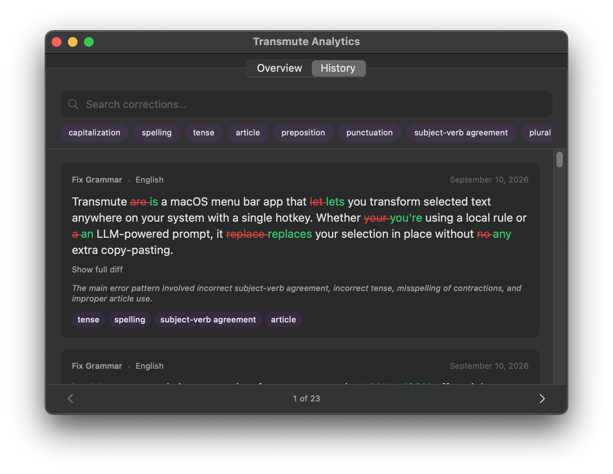

# Transmute

**Select text anywhere on macOS, press `⌥⇧T`, transform it in place.**

No copy-paste into ChatGPT. No context switching. Just your text, fixed.

## Capabilities

**Summon it anywhere.** One shortcut opens a floating panel next to your cursor in any app. Mail, Slack, Xcode, a PDF, it doesn't matter. Pick a transformation, the selection is replaced in place.

**Bring your own LLM.** Anthropic, OpenAI, Gemini or a local model. Your key, your choice, swappable anytime in Settings.

 

**Commands that fit how you write.** Fix grammar, rewrite, shorten, change tone or define your own custom command with a name, icon and prompt.

 

**See what changed.** Every transformation is logged with a before/after diff, so you can review or revert with confidence.

 

## Security

Everything lives on your Mac. No accounts, no telemetry, no cloud sync. API keys are stored in the macOS Keychain, never in plain text and the transformation history behind Analytics/diff is a local JSON file on disk - never transmitted anywhere. Point Transmute at a local LLM (Ollama, LM Studio, etc.) and your text never leaves your machine at all.

## Installation

1. Download `transmute.app.zip` from the [latest release](https://github.com/alexschedrov/transmute/releases/latest) and unzip it into `/Applications`.
2. `xattr -cr /Applications/transmute.app` (strips the Gatekeeper quarantine - this is an unsigned, non-notarized build).
3. Launch, then grant Accessibility permission when prompted.

Prefer to build it yourself from source? See [docs/Installation.md](docs/Installation.md).

## License

[MIT](LICENSE) © Alex Schedrov - contributions welcome, see [CLA.md](CLA.md).
