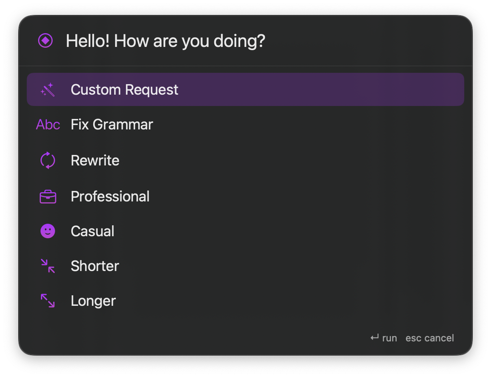

# Transmute

Feel tired of copying & pasting text to ChatGPT, Claude or other AI tools? 

Transmute is a native MacOS application to transform selected text anywhere (any application) with a single shortcut. Select text in any app, press **⌥⇧T**, pick an action - the selection is replaced in place.



## Principles

- **Simple.** One shortcut, one panel, one purpose. No accounts, no telemetry, no cloud sync.
- **Native.** Pure SwiftUI + AppKit. Feels like a macOS app because it is one.
- **LLM-agnostic.** Anthropic, OpenAI, Gemini or local LLMs - your key, your choice. Swap providers in Settings.
- **Lightweight.** A menu bar app that stays out of the way until you summon it. Minimal code, minimal surface area.

## Features

- Fix grammar, rewrite, change tone, shorten, lengthen
- Custom requests ("translate to French", "convert to bullet points", …)
- Works in any app via the macOS Accessibility API
- Optional "writing style" preference to keep your voice across transformations

## Install

1. Open `transmute.xcodeproj` in Xcode.
2. Product → Scheme → Edit Scheme → Run → **Build Configuration: Release**.
3. Product → Build (⌘B).
4. Project navigator → **Products** → right-click `transmute.app` → **Show in Finder**.
5. Drag `transmute.app` into `/Applications`.
6. Strip Gatekeeper quarantine (unsigned build):
   ```
   xattr -cr /Applications/transmute.app
   ```
7. Launch, then grant Accessibility permission: System Settings → Privacy & Security → Accessibility → enable `transmute`.

## Use it

Open **Settings** → pick a provider and paste your API key. Then: select text anywhere → **⌥⇧T** → choose an action (or `Custom Request` for ad-hoc instructions).

## Contributing

Contributions are welcome. By submitting a pull request, you agree to the terms of the [Contributor License Agreement](CLA.md).

## License

[MIT](LICENSE) © Alex Schedrov
